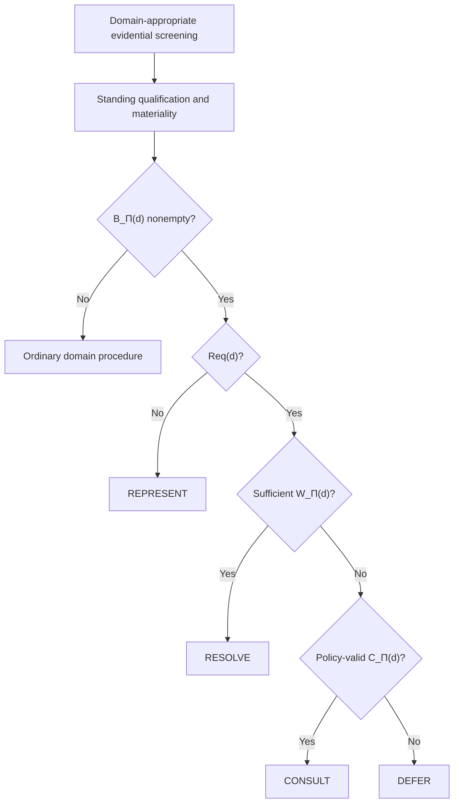

# The Pluralism Gate

*When Should AI Agents Decide Under Irreducible Value Conflict?*

The Pluralism Gate is a decision protocol for agentic settings in which material value conflict remains after domain-appropriate evidential screening. The framework keeps three questions separate: how common a position is in the available information, which stakeholders have standing with respect to the decision, and whether the agent has authority to commit to one contested outcome.

For a decision with surviving standing-grounded conflict, the Gate returns one of four regimes: **REPRESENT**, **RESOLVE**, **CONSULT**, or **DEFER**. The result depends on whether the task requires commitment, whether the applicable policy recognizes a sufficient resolution warrant, and whether consultation can supply or clarify the authority needed before action.

**[Specification](SPECIFICATION.md)** · **[Audit schema](schemas/)** · **[Worked records](examples/)** · **[Stress tests](stress-tests/)** · **[Counterfactual tests](counterfactual-tests/)** · **[Evaluation guide](docs/evaluation-guide.md)** · **[Adoption guide](docs/adoption-guide.md)** · **[Terminology](terminology.md)** · **[FAQ](docs/faq.md)**

---

## What is in this repository

| Component | Contents |
| --- | --- |
| `SPECIFICATION.md` | Implementation-facing statement of the formal framework |
| `schemas/` | JSON Schema for the eight-field audit record |
| `templates/` | Blank decision-record template |
| `examples/` | Worked records, incomplete case records, and negative validation tests |
| `stress-tests/` | The six specification cases from Table 2 |
| `counterfactual-tests/` | The six controlled perturbations from Table 4 |
| `data/` | CSV and JSON versions of the paper tables used by the repository |
| `protocol/` | The four protocol properties in a compact implementation-oriented form |
| `evaluation/` | Benchmark and reporting material |
| `docs/` | Adoption notes, evaluation procedure, and FAQ |
| `tools/` | Dependency-free semantic validator |

The repository is intended for researchers implementing the Gate in an agent controller, evaluating completed decision traces, or constructing benchmarks in which evidence, standing, and decision authority need to remain separately observable.

## Decision flow



The Gate is applied only after evidential screening and standing qualification have produced a nonempty unresolved conflict set. It governs authority over the contested commitment; safety constraints, legal permissibility, feasibility, and other domain requirements remain part of the surrounding system.

## Core decision rule

Let `Req(d)` indicate that the current task requires commitment to a contested option, `W_Π(d)` that the deployment policy recognizes a sufficient resolution warrant, and `C_Π(d)` that a policy-valid consultation path can materially supply or clarify the authority needed before commitment.

| Regime | Condition | Operational interpretation |
| --- | --- | --- |
| `REPRESENT` | `¬Req(d)` | Preserve the material disagreement for the user or downstream decision-maker. |
| `RESOLVE` | `Req(d) ∧ W_Π(d)` | Commit under a sufficient warrant covering the material unresolved conflicts relevant to the choice. |
| `CONSULT` | `Req(d) ∧ ¬W_Π(d) ∧ C_Π(d)` | Seek input from a recognized stakeholder or decision-maker who can supply or clarify the missing authority. |
| `DEFER` | otherwise | Do not make the contested commitment when neither a sufficient warrant nor a usable consultation path is available. |

The full definitions of standing, admissible reasons, the four-valued information state, the unresolved conflict set, resolution warrants, and premature value collapse are collected in [`SPECIFICATION.md`](SPECIFICATION.md).

## Decision records

The audit record follows the eight fields in Table 3: decision propositions, standing, admissible reasons, conflict set, task state, consultation, resolution warrant, and Gate outcome. [`schemas/decision-record.schema.json`](schemas/decision-record.schema.json) gives these fields a common JSON representation, while [`tools/validate_record.py`](tools/validate_record.py) checks relationships that are awkward to express in JSON Schema alone.

A new record can be started from [`templates/decision-record.json`](templates/decision-record.json). To validate one or more complete records:

```bash
python tools/validate_record.py examples/valid/*.json
```

The validator checks reference integrity, reason attribution, two-sided conflict representation, warrant coverage, consultation-route completeness, Gate invocation, and the regime implied by the decision rule.

## Worked examples

The worked records use the Table 2 cases as concrete inputs to the schema. Some case descriptions leave details implicit that a machine-readable record must make explicit. Where a complete example requires a small modeling choice, the record includes a short `notes` entry describing that choice. These notes are part of the repository example rather than additional claims about the case.

`examples/incomplete-examples/` contains the medical and explicit-jurisdiction cases in compact form because the paper does not specify enough stakeholder/reason structure to populate every schema field cleanly. `examples/negative-tests/` contains complete records with intentionally incorrect Gate outcomes so that semantic validators can be tested against known failures.

## Stress and counterfactual tests

The six stress tests exercise the framework across factual disagreement, affected-party consultation, Indigenous land-use conflict, user-controlled preference, jurisdictional authority, and advisory presentation. They are collected in [`stress-tests/`](stress-tests/).

The six counterfactual tests vary one part of the decision structure at a time: prevalence, standing, evidence, warrant status, task requirements, or stakes. They are collected in [`counterfactual-tests/`](counterfactual-tests/). Together, the two sets provide a compact way to test whether an implementation responds to the variables identified by the formal specification rather than to incidental properties of retrieved text.

## Evaluation and benchmark use

A benchmark can retain evidential status, candidate stakeholder claims, an explicit standing profile, and any applicable resolution warrant as separate annotations. When standing itself is contested, the same scenario can be evaluated under more than one declared policy profile rather than being forced into a single policy-independent label.

The counterfactual tests are useful for checking implementation behavior under controlled changes. Matched retrieval variants can also be used to study whether a standing-grounded perspective disappears because it is difficult to retrieve rather than because the declared policy excludes it. The repository's [`evaluation/`](evaluation/) and [`docs/evaluation-guide.md`](docs/evaluation-guide.md) files provide reporting fields and a suggested evaluation sequence.

## Repository conventions

`PG-ST1`–`PG-ST6` and `PG-CF1`–`PG-CF6` are repository identifiers for the stress-test and counterfactual rows. JSON field names and serialization details are implementation conventions used to make the framework easier to inspect and compare programmatically. The formal definitions and decision regimes are those described in the paper.
